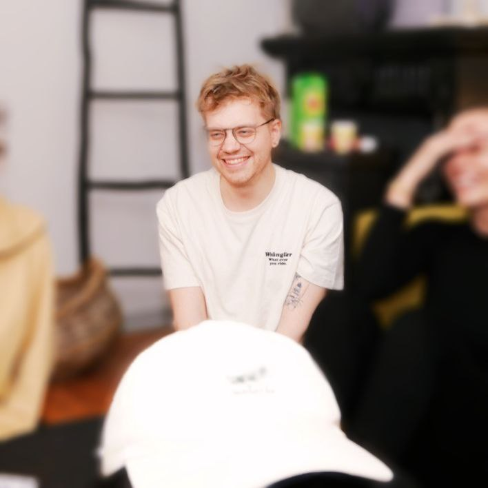
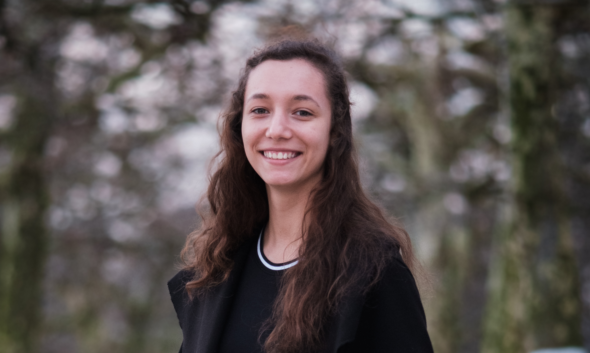

<!-- Section -->
<!-- <section>
	<header class="major">
		<h2>Our Goals</h2>
	</header>
	

		<article>
			
			

				<h3>Portitor ullamcorper</h3>
				
Aenean ornare velit lacus, ac varius enim lorem ullamcorper dolore. Proin aliquam facilisis ante interdum. Sed nulla amet lorem feugiat tempus aliquam.

			

		</article>
		<article>
			
			

				<h3>Sapien veroeros</h3>
				
Aenean ornare velit lacus, ac varius enim lorem ullamcorper dolore. Proin aliquam facilisis ante interdum. Sed nulla amet lorem feugiat tempus aliquam.

			

		</article>
		<article>
			
			

				<h3>Quam lorem ipsum</h3>
				
Aenean ornare velit lacus, ac varius enim lorem ullamcorper dolore. Proin aliquam facilisis ante interdum. Sed nulla amet lorem feugiat tempus aliquam.

			

		</article>
		<article>
			
			

				<h3>Sed magna finibus</h3>
				
Aenean ornare velit lacus, ac varius enim lorem ullamcorper dolore. Proin aliquam facilisis ante interdum. Sed nulla amet lorem feugiat tempus aliquam.

			

		</article>
	

</section> -->

<!-- Section -->
<section>
	<header class="major">
		<h2>About the Board</h2>
	</header>
	

		<article>
			
			<h3>President</h3>
			
Awad Daniel from France.

			<ul class="actions">
				<li><a href="{{ '21board/21pres.html' | absolute_url }}" class="button">More</a></li>
			</ul>
		</article>
		<article>
			
			<h3>PR Officer</h3>
			
Victor Zimmermann from Germany.

			<ul class="actions">
				<li><a href="{{ '21board/21pr.html' | absolute_url }}" class="button">More</a></li>
			</ul>
		</article>
		<article>
			
			<h3>Network Development Officer</h3>
			
Aaricia Herygers from Belgium.

			<ul class="actions">
				<li><a href="{{ '21board/21ndo.html' | absolute_url }}" class="button">More</a></li>
			</ul>
		</article>
		<article>
			<!---->
			<h3>Vice President</h3>
			
Riley Crouch from the UK.

			<!--<ul class="actions">
				<li><a href="{{ '21board/21vp.html' | absolute_url }}" class="button">More</a></li>
			</ul>-->
		</article>
		<article>
			<!---->
			<h3>Secretary</h3>
			
Hafren Vaughan from the UK.

			<!--<ul class="actions">
				<li><a href="{{ '21board/21sec.html' | absolute_url }}" class="button">More</a></li>
			</ul>-->
		</article>
		<article>
			<!---->
			<h3>Treasurer</h3>
			
Pauline Sander from Germany.

			<!--<ul class="actions">
				<li><a href="{{ '21board/21treas.html' | absolute_url }}" class="button">More</a></li>
			</ul>-->
		</article>
		<article>
			<!---->
			<h3>Legal Officer</h3>
			
Teva Pietruszka from France.

			<!--<ul class="actions">
				<li><a href="{{ '21board/21lo.html' | absolute_url }}" class="button">More</a></li>
			</ul>-->
		</article>
		
		
	

</section>
